# AI Operating System Implementation Plan

This document defines the full end-to-end system for turning a Linear ticket
into reviewed, tested, proof-backed software across web, desktop, mobile, AI,
and release surfaces.

The goal is not to install more tools. The goal is to make the tools operate as
one machine.

## Product Thesis

Linear is the work system. GitHub is the code-review system. Symphony is the
agent runner. AI Dev Kit is the reusable harness. The project repo supplies
product-specific facts: design tokens, platforms, services, routes, native IDs,
and acceptance tests. The dashboard is the proof and control surface for humans.

```mermaid
flowchart LR
  linear[Linear ticket] --> dashboard[Dashboard control plane]
  dashboard --> symphony[Symphony orchestrator]
  symphony --> workspace[Isolated workspace]
  workspace --> code[Codex implementation]
  code --> tiers[Tiered verification]
  tiers --> proof[Proof packet]
  proof --> pr[GitHub PR]
  pr --> dev[development]
  dev --> staging[staging release candidate]
  staging --> main[main production/tagged release]
```



## Reusable Versus Project-Specific

AI Dev Kit owns the reusable machinery:

- project profile schema and validator
- tier runner
- proof packet schema
- dashboard shell and proof viewers
- design-system registry structure
- Expect integration
- Playwright proof conventions
- PR proof template
- Symphony adapter expectations
- GitHub/Vercel/Linear connector shape
- native-test interface
- cost and time watchdog policies

Each project owns its profile:

- product name, repo, Linear project, branch model
- enabled platforms
- enabled services
- design tokens and design-system registry
- reference product surfaces
- provider env vars
- native app identifiers and review channels
- project-specific tests and acceptance criteria

The required file is:

```text
.ai-dev-kit/project-profile.json
```

That file is how every project gets the opinionated default stack while still
declaring what is true for that project.

## Target Ticket Flow

1. A human creates or approves a Linear ticket.
2. The dashboard shows the ticket as eligible or blocked.
3. The human starts the run from the dashboard or applies the `agent:codex`
   label.
4. Symphony creates an isolated workspace from `development`.
5. Codex reads the ticket, profile, docs, and acceptance criteria.
6. Codex reproduces or establishes the baseline.
7. Codex implements only the scoped change.
8. Tier 0, Tier 1, and ticket-specific Tier 2 proof run.
9. UI/usability/native work also runs Tier 3 or Tier 5 as required.
10. `pnpm test:proof` generates `.evidence/proof-packet.json`.
11. Codex opens a PR to `development`.
12. The dashboard links Linear, branch, PR, CI, Vercel preview, proof packet,
    screenshots/videos, Expect output, and native artifacts.
13. A human reviews with AI assistance.
14. The PR merges to `development`.
15. `development` promotes to `staging`.
16. `staging` creates release-candidate web/native artifacts.
17. Human QA approves native/device behavior.
18. `main` and version tags ship production.

## Scope Classes

| Class | AI authority | Required proof |
| --- | --- | --- |
| Low-risk bug | Full implementation | Tier 0-2 |
| Defined feature | Full implementation | Tier 0-2 plus targeted route/API proof |
| UI polish | Full implementation from design system | Tier 0-3, screenshots/video |
| Open design | Human-led until mockup/design-system update exists | Design review, then Tier 0-3 |
| Native shell | AI-assisted implementation | Tier 0-3 plus native artifact/simulator proof |
| Auth/billing/security | AI-assisted implementation | Tier 0-2 plus human review, no auto-merge |
| Release | AI-assisted execution | Tier 5, artifacts, human approval |

## Tier Enforcement

The agent may choose additional tests. Minimum gates are not optional.

| Tier | Purpose | Enforced by |
| --- | --- | --- |
| 0 | Syntax, structure, project profile | pre-commit, Symphony baseline |
| 1 | Fast deterministic confidence | pre-push, PR CI |
| 2 | Focused ticket proof | PR CI, Symphony before review |
| 3 | Visual, usability, mobile web, Expect | UI/staging/native-sensitive work |
| 4 | Background regression and drift | nightly/weekly |
| 5 | Release/native artifact proof | staging/main/tag release |

## Proof Packet

Every ticket needs one proof packet. It is a machine-readable bundle, not just a
human summary.

```text
.evidence/proof-packet.json
```

The packet should contain:

- project profile status
- git branch/head/status
- changed files
- tier results
- unit/API/eval results
- Playwright reports
- Expect result when used
- screenshots/video/artifacts
- native artifacts when relevant
- known warnings and blocked checks

## Expect Policy

Expect is an AI browser QA layer built on top of Playwright. It is useful for
usability and exploratory web proof. It is not a replacement for deterministic
Playwright regression tests, and it does not currently cover native mobile.

Use Expect when the ticket changes:

- a user-facing flow
- a page layout
- a form
- navigation
- onboarding/auth screens
- dashboard controls

Do not run Expect for every backend-only ticket. Static Expect coverage is cheap
and runs in Tier 1. Full Expect proof runs in Tier 3 when explicitly required by
the ticket or release workflow.

## Native Testing Policy

Native proof has three layers:

1. Build proof: Capacitor/Electron build succeeds.
2. Simulator/emulator proof: app launches and key flows work.
3. Real-device proof: TestFlight/APK/signed desktop install is reviewed.

Playwright covers the web UI. Native shell behavior needs native tooling.

Required native flows for Layers:

- iOS safe-area / Dynamic Island layout
- Android status/nav bar layout
- Google OAuth opens external browser/custom tab and deep-links back
- microphone permission and recording state
- background/foreground recovery
- desktop install and launch smoke

The first native E2E harness should be Maestro because it can express cross-
platform iOS/Android flows with readable YAML and can run against simulators or
real devices.

## Dashboard Plan

`work.hustletogether.com` should become the portfolio control plane.

```text
/projects
  /layers
    /tickets
    /runs
    /pull-requests
    /proof
    /regressions
    /design-system
    /deployments
    /native-builds
    /cost
```

The project-local `/dev-kit` dashboard remains the app-specific harness view.
The portfolio dashboard links to each project dashboard and its Symphony runs.

## Runaway Controls

Symphony must stop instead of continuing to spend tokens when the work is not
making progress.

| Condition | Action |
| --- | --- |
| No file changes after configured minutes | Stop and mark blocked |
| Tier 0 baseline fails | Stop before implementation |
| Same failure repeats twice | Stop and attach proof |
| Max agent turns reached | Stop and preserve workspace |
| Scope is unclear | Ask in Linear/dashboard |
| Proof packet missing | Do not move to review |

For Layers, the initial concurrency remains `1`.

## Implementation Phases

### Phase 1: Project Contract

- Add `.ai-dev-kit/project-profile.json`.
- Validate required tools, services, platforms, and design-system files.
- Show profile/readiness in `/dev-kit/project`.
- Include profile status in proof packet.

### Phase 2: Mechanical Gates

- Run profile validation in Tier 0.
- Run Expect coverage in Tier 1.
- Run Expect proof in Tier 3 when requested.
- Require proof packets before review.

### Phase 3: Dashboard Proof Center

- Add proof packet viewer.
- Link PR, CI, Vercel preview, Symphony run, Linear ticket.
- Show screenshots/videos/Expect output.
- Show native artifacts for staging/release tickets.

### Phase 4: Symphony Hardening

- Version-control live workflow.
- Add workflow drift detection.
- Add proof-required status transition.
- Add token/time/no-progress watchdogs.
- Keep concurrency at `1` until several tickets complete cleanly.

### Phase 5: Native Proof

- Add Maestro config and first flows.
- Add iOS OAuth deep-link proof.
- Add iOS safe-area proof.
- Add Android status/nav bar proof.
- Attach TestFlight/APK artifacts to proof packet.

### Phase 6: Review Automation

- Add AI reviewer for scope, tests, proof, and risk.
- Optionally add CodeRabbit as an additional reviewer.
- Keep human approval required for now.

## Current Implementation Status

Implemented in this repo:

- project profile schema, profile file, validator, Tier 0 enforcement, and
  `/dev-kit/project`
- proof packet enrichment and `/dev-kit/proof`
- Expect coverage gate plus opt-in Expect browser proof runner
- portable Chromium fallback for local browser proof
- focused Tier 2 proof for changed work
- visual Tier 3 lanes split by mobile and desktop
- project connector contract under `lib/connectors`
- documented branch and release model for `development`, `staging`, and `main`

Still required before claiming full native/release automation:

- real environment secrets for Supabase, AI Gateway, Linear, Resend, Stripe,
  AssemblyAI, Deepgram, Langfuse, and Firecrawl in the target runtime
- Maestro simulator flows for iOS/Android safe areas, OAuth deep-link return,
  microphone permission, and foreground/background recovery
- TestFlight/APK/DMG/EXE artifacts attached to proof packets in Tier 5
- design-system registry reconciliation once the starter-kit cross-reference
  checker supports the repo's kebab-case component registry names, or after the
  components registry is migrated to the checker naming convention
- human approval policy in GitHub branch protection for native, auth, billing,
  security, database, and release changes
- Introduce auto-merge only for explicitly low-risk, proof-complete changes.

### Phase 7: Multi-Project Reuse

- Extract project-profile validator into AI Dev Kit package.
- Extract proof packet schema into AI Dev Kit package.
- Extract dashboard shell into AI Dev Kit package.
- Keep per-project profiles in each repo.
- Add portfolio dashboard that reads all project profiles.

## Current Layers Baseline

Layers already has:

- Vitest tests
- API/contract tests
- Playwright E2E and visual tests
- Expect dependency and Expect route coverage
- design tokens and design-system registries
- `/dev-kit` dashboard
- Vercel/GitHub release workflows
- Capacitor and Electron build paths
- Symphony deployment on CT 102

The immediate gap is not tool installation. The gap is enforcing the project
profile, proof packet, Symphony workflow, dashboard proof center, and native
test harness as one system.
