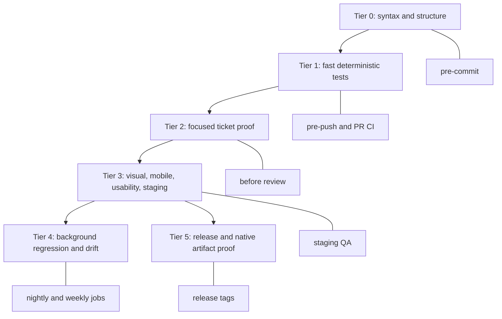

# Production Quality System

Audience: operators, engineering leads, and executives who need to understand
how Layers moves from idea to production across web, desktop, mobile, AI, and
native release channels.

## Executive Summary

Layers is not one app surface. It is a multi-platform product with:

- web app on Vercel
- Electron desktop app for macOS and Windows
- Capacitor mobile app for iOS and Android
- AI runtime calls through Vercel AI Gateway and vendor APIs
- Supabase auth/data, Stripe billing, transcription providers, MCP tools, and
  the AI starter-kit control plane

The production system therefore has two separate but connected ladders:

1. Branch promotion: `development` -> `staging` -> `main`.
2. Verification tiers: Tier 0 through Tier 5.

Every project also declares a project operating profile at
`.ai-dev-kit/project-profile.json`. That file is the bridge between the
reusable AI Dev Kit harness and the project-specific facts: platforms, services,
design tokens, branch model, dashboard obligations, and proof policy.

`development` is where feature work integrates. `staging` is where release
candidate artifacts are built and sent to GitHub Actions/TestFlight for QA.
`main` is production: Vercel deploys the web app, and version tags from `main`
publish GitHub Release artifacts and upload iOS to TestFlight.

## Branch And Release Diagram

```mermaid
flowchart LR
  feature[Feature or Symphony branch] --> prDev[PR to development]
  prDev --> dev[development]
  dev --> prStaging[PR development to staging]
  prStaging --> staging[staging]
  staging --> rc[Release candidate build]
  rc --> gha[GitHub Actions artifacts]
  rc --> tfStaging[TestFlight internal QA]
  staging --> prMain[PR staging to main]
  prMain --> main[main]
  main --> vercel[Vercel production web]
  main --> tag[Tag vX.Y.Z]
  tag --> native[Native release build]
  native --> ghRelease[GitHub Release latest assets]
  native --> tfMain[TestFlight production candidate]
  ghRelease --> download[/download page]
```

## Branch Responsibilities

| Branch | Purpose | Native builds | Public website | TestFlight | GitHub Release |
| --- | --- | --- | --- | --- | --- |
| `development` | Feature integration and Symphony PR target | No | No production deploy | No | No |
| `staging` | Release candidate soak and native QA | Yes | No production deploy | Yes, internal QA build | No public release |
| `main` | Production web and tagged release source | On tag | Yes | Yes on release tag | Yes on release tag |

The production branch is `main`; do not add a separate `production` branch
unless we intentionally migrate Vercel and the release process.

## Verification Tier Diagram



## What The AI Starter Kit Covers

```mermaid
flowchart LR
  starter[AI Starter Kit] --> registries[Registries]
  starter --> tests[Verification tiers]
  starter --> browser[Playwright and Expect]
  starter --> evals[AI/tool evals]
  starter --> evidence[Evidence packets]
  starter --> dashboard[/dev-kit dashboard]
  starter --> hooks[Agent hooks]
  starter --> profile[Project profile]

  registries --> pages[Pages]
  registries --> components[Components]
  registries --> apis[API routes]
  registries --> vendors[Vendors and dependencies]

  tests --> unit[Vitest]
  tests --> contracts[Contracts]
  tests --> integration[Integration]
  tests --> e2e[End-to-end]
  tests --> native[Native release proof]

  browser --> visual[Visual regression]
  browser --> mobile[Mobile matrix]
  browser --> usability[Usability proof]

  evidence --> symphony[Symphony]
  evidence --> pr[GitHub PR]
  evidence --> linear[Linear ticket]
  profile --> designTokens[Design tokens]
  profile --> services[Default services]
  profile --> platforms[Enabled platforms]
```

## Traditional Development Coverage

| Risk | Primary coverage | Tier |
| --- | --- | --- |
| Type or API misuse | TypeScript | Tier 0 |
| Vendor model/API string drift | registries and deprecation scanners | Tier 0 |
| Pure logic regressions | Vitest unit tests | Tier 1 |
| API contract drift | route contracts and integration tests | Tier 1 or Tier 2 |
| UI route breakage | Playwright smoke/focused specs | Tier 2 |
| Mobile layout defects | Playwright mobile projects plus native simulator tests | Tier 3 |
| Visual regressions | visual specs and screenshots | Tier 3 |
| AI behavior drift | eval suites and tool rubrics | Tier 4 |
| Dependency vulnerabilities | dependency audit registry | Tier 4 |
| Cost drift | budget and cost-drift jobs | Tier 4 |
| Native artifact failure | Electron/Capacitor build workflows | Tier 5 |
| Native OAuth/deep-link drift | native config proof and Maestro flow | Tier 5 |

## Platform Testing Strategy

### Web

Automated:

- TypeScript, unit, integration, contracts.
- Playwright desktop/tablet/mobile browser matrix.
- Visual regression for touched routes/components.
- Vercel preview and production build guard.

Manual:

- Production account smoke after `main` deploy.
- Billing and OAuth smoke with real provider dashboards when secrets or callback
  URLs changed.

### Electron macOS

Automated:

- `electron-builder` on macOS runners.
- DMG/ZIP artifact generation.
- Signing/notarization when Apple Developer ID secrets are present.

Manual:

- Install DMG on a clean macOS machine.
- Confirm Gatekeeper behavior.
- Confirm microphone/system-audio permissions.
- Confirm auto-update or download route behavior when that surface changes.

### Electron Windows

Automated:

- `electron-builder` on Windows runners.
- EXE/MSI artifact generation.

Manual:

- Install on a clean Windows VM.
- Confirm SmartScreen/signing behavior.
- Confirm microphone permissions and recorder flow.
- Execute the Windows Electron smoke runbook in
  [`docs/qa/windows-electron-smoke.md`](qa/windows-electron-smoke.md) before
  claiming a Windows QA pass.

Current signing note: Windows Authenticode signing is still placeholder until an
OV/EV certificate is acquired and wired into CI.

### Capacitor iOS

Automated:

- Capacitor sync.
- Xcode archive/export on macOS runner.
- TestFlight upload from `staging` and release tags when App Store Connect API
  secrets are configured.

Manual:

- TestFlight install on real iPhone.
- Safe-area/Dynamic Island review on current iPhone models.
- Sign in, recording, microphone permission, background/foreground, and deep
  link flows on device.

Native Google OAuth must not run inside the WebView. Layers routes native Google
sign-in through Capacitor Browser and returns through
`com.mirrorfactory.layers://auth/callback`, where the client-side native auth
bridge exchanges the Supabase PKCE code. Tier 5 checks the native scheme,
Android intent filter, iOS URL scheme, and release workflow bundle id before
native proof can be considered complete.

### Capacitor Android

Automated:

- Capacitor sync.
- Gradle APK build.
- Future: emulator smoke for sign-in, navigation, microphone permission, and
  safe-area/system-bar layout.

Manual:

- Install APK on a real Android device.
- Confirm Google sign-in returns to the app.
- Confirm microphone permission and recording state.
- Confirm keyboard, back-button, status-bar, and navigation behavior.

## Native Bugs Need Native Tests

Playwright is excellent for web UI confidence, but it does not fully prove the
native shells. Native-specific bugs need native testing:

| Bug class | Best automated check | Manual check still required |
| --- | --- | --- |
| Dynamic Island/status bar overlap | iOS simulator screenshot test | real iPhone spot check |
| Android system bar overlap | Android emulator screenshot test | real Android spot check |
| Google OAuth exits app | native deep-link integration test | TestFlight/APK sign-in |
| Microphone permission behavior | simulator/emulator permission test | real device recording |
| App background/foreground recovery | native simulator test | real device meeting flow |
| App Store/TestFlight signing | CI archive/export/upload | App Store Connect review |

The right goal is not "everything automated." The right goal is that every bug
that can regress gets either an automated check or an explicit manual release
checklist item.

## Regression Intake

Every production or QA bug should become a regression item:

1. Capture the platform, build number, branch, device, route, and account type.
2. Decide whether it belongs to web, Electron, iOS, Android, API, AI, or vendor.
3. Add the lowest-cost failing check that would have caught it.
4. Link the check to the Linear ticket and PR.
5. Assign the check to Tier 1, 2, 3, 4, or 5 based on cost.

Examples:

- Dynamic Island overlap -> iOS safe-area ticket, Tier 3 screenshot proof,
  manual TestFlight verification.
- Gmail login leaves app -> Capacitor OAuth deep-link ticket, Tier 3 native
  integration proof, manual iOS/Android device verification.
- Broken GitHub download link -> Tier 5 release artifact proof.
- Bad AI summary quality -> Tier 4 eval case plus production sample fixture.

## Symphony Capacity

Current Symphony configuration on CT 102:

```yaml
agent:
  max_concurrent_agents: 1
  max_turns: 5
```

That means Symphony should run one active ticket at a time right now.

This is conservative and correct until the harness is consistently green. The
safe scaling path is:

| Stage | Max agents | Requirement |
| --- | --- | --- |
| Current | 1 | Tier 0-2 stable and no runaway token use |
| Pilot | 2 | two small tickets complete without branch/workspace conflicts |
| Operating | 3 | dashboard shows clear evidence packets and budget controls |
| Scale | 5 | queue prioritization, auto-pause, and failed-run triage are reliable |

Do not raise concurrency just because the machine can handle it. Raise it when
the review system can handle it.

## Release Gates

### Development

Required before merge:

- Tier 0
- Tier 1
- focused Tier 2 proof for touched surfaces
- PR review

No native build should run on `development`.

### Staging

Required after merge:

- web build guard
- Electron macOS artifact
- Electron Windows artifact
- Android APK artifact
- iOS archive/export and TestFlight upload when secrets are configured
- Tier 3 proof for UI/mobile-sensitive changes

Staging artifacts live in GitHub Actions artifacts and TestFlight. They do not
update the public `/download` page.

### Main

Required before merge:

- PR from `staging`
- Tier 0-2 green
- release manager approval

After merge:

- Vercel deploys production web.

After tag:

- native release build runs
- GitHub Release is published with stable asset names
- `/download` points at the new latest release assets
- TestFlight receives the production candidate

## Executive Confidence Criteria

The environment is production-grade when:

- branch protection prevents direct pushes to `development`, `staging`, and
  `main`
- no agent can move a ticket to review without Tier 1 and Tier 2 evidence
- staging builds native artifacts and iOS TestFlight without updating public
  release assets
- main production deploys only through PR promotion from staging
- release tags from main publish GitHub Release assets and TestFlight builds
- platform-specific bugs are tracked as platform-specific regression tests or
  manual checklist items
- `/dev-kit`, GitHub PRs, Linear tickets, and Symphony all link the same proof
  packet

## Operational Links

- Branch/release flow: `docs/RELEASE.md`
- Native release pipeline: `docs/RELEASE_PIPELINE.md`
- Harness tiers: `docs/AI_HARNESS_TIERS.md`
- Signing: `docs/SIGNING.md`
- Feature test map: `docs/FEATURE_TEST_PLAN.md`
- Marketing/product test matrix: `docs/FEATURE_TEST_MARKETING_MATRIX.md`

## External Platform References

- Capacitor Browser plugin: <https://capacitorjs.com/docs/apis/browser>
- Capacitor deep links: <https://capacitorjs.com/docs/guides/deep-links>
- Google OAuth embedded WebView policy: <https://developers.googleblog.com/upcoming-security-changes-to-googles-oauth-20-authorization-endpoint-in-embedded-webviews/>
